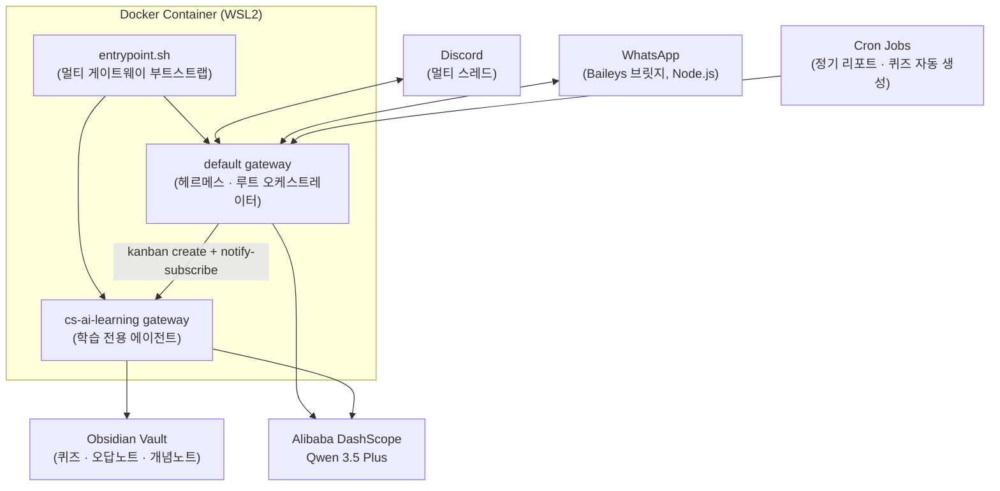

# Hermes AI Agent System

개인용 로컬 AI 에이전트를 **멀티 프로필 · 멀티 채널 오케스트레이션 플랫폼**으로 확장한 프로젝트입니다.
오픈소스 에이전트 프레임워크(Hermes Agent) 위에 Discord 게이트웨이, cron 기반 자동화, Obsidian 연동 학습 튜터 에이전트를 직접 설계·구축하여 WSL2 + Docker 환경에서 상시 운영했습니다.

> 이 저장소는 실제 운영 스냅샷에서 API 키·토큰·개인 식별 정보를 전부 제거하고 플레이스홀더로 치환한 **포트폴리오 공개용 버전**입니다.

---

## 📌 본인 직접 설계·구현 범위

> 아래 항목은 오픈소스 프레임워크를 **가져다 쓴 것이 아니라 직접 설계하거나 원인을 파고들어 해결한 것**입니다.

| 구분 | 내용 |
|---|---|
| 멀티 프로필 오케스트레이션 설계 | default ↔ cs-ai-learning 역할 분리, 위임 방식 비교 검증 후 채택 |
| Discord 자동화 | cron 5종 + kanban notify-subscribe 기반 완료 통보 경로 구축 |
| 학습 튜터 에이전트 | SOUL.md · 스킬 · 퀴즈 시스템 전체 설계 |
| Docker 배포 구성 | DNS 고정, 멀티 게이트웨이 부트스트랩, UID remap, stop_grace_period 설정 |
| 트러블슈팅 (5건, 아래 상세 기술) | 단순 재시작이 아닌 내부 구조 파악 후 근본 원인 해결 |

> WhatsApp 브릿지(`scripts/whatsapp-bridge/`)는 Hermes Agent 공식 모듈을 배포·운영한 것으로, 직접 작성한 코드가 아닙니다.

---

## 1. 프로젝트 개요

| 항목 | 내용 |
|---|---|
| 목적 | 개인 AI 비서를 상시 운영 가능한 형태로 구축하고, 자동화(학습 튜터·퀴즈 봇)를 얹기 |
| 운영 환경 | Windows + WSL2 + Docker Desktop |
| 에이전트 코어 | Hermes Agent (Nous Research, MIT License) — vendored & 커스터마이징 |
| LLM Provider | Alibaba Cloud DashScope (Qwen 3.5 Plus) |
| 운영 실적 | 일일 퀴즈 자동 실행 34회, 주간 AI 트렌드 리포트 6회 (cron 실행 기록 기준) |

---

## 2. 아키텍처

하나의 컨테이너 안에서 **두 개의 독립된 에이전트 게이트웨이**를 동시에 구동하고, 작업 위임은 kanban CLI + notify-subscribe 방식으로 처리합니다.



### 설계 포인트 — 위임 방식 선택 과정

위임 방식을 최종 확정하기까지 세 가지 경로를 직접 구현·비교했습니다.

| 방식 | 검증 결과 | 채택 여부 |
|---|---|---|
| `delegate_task` (프레임워크 내장) | 서브에이전트가 부모 모델·설정을 상속 → cs-ai-learning SOUL.md 지침 무시됨 | ❌ 폐기 |
| `kanban_create` 에이전트 도구 | 공식 문서상 수정됐으나 실제 빌드에서 미작동 (공식 이슈 #18968 확인) | ❌ 폐기 |
| `hermes kanban` CLI + `notify-subscribe` | cs-ai-learning이 독립 프로필로 spawn, 완료 시 Discord 자동 통보 | ✅ 채택 |

**결론**: 공식 문서에 "수정됨"이라고 나와도 실제 빌드에서 동작하지 않을 수 있으므로, 반드시 독립 재현 테스트를 거쳐야 한다는 교훈을 얻었습니다.

---

## 3. 주요 기능

### 🤖 멀티 프로필 에이전트 오케스트레이션
- default 에이전트: Discord 연결 + 의도 분류 + 위임 담당
- cs-ai-learning: Discord 연결 없이 kanban 위임만 수신 → 자체 모델·SOUL.md·mnemosyne 기억으로 독립 처리
- 프로필별 독립된 `config.yaml` / `SOUL.md` / 메모리 스코프

### 💬 Discord 멀티스레드 자동화
- cron 5종으로 퀴즈·리포트를 학습 스레드에 자동 전달
- 위임 완료 시 사용자 개입 없이 Discord 자동 통보 도착 (kanban notify-subscribe 경로)

### 🎓 CS/AI 학습 튜터 에이전트 (`cs-ai-learning` 프로필)
- 20년차 백엔드 튜터 페르소나, Java/Spring 중심 실무 코드 + 상세 주석
- **3단계 점진적 힌트** 시스템 → 정답 제공 (퀴즈 최초 응답에 정답·해설 포함 금지 강제)
- 오답노트 자동 생성 → Obsidian 위키링크로 개념노트와 연결 → 주간 MOC 인덱스 자동 반영
- 오답 빈도 기반 가중 재출제 (오답 최다 30% · 차순위 20% · 중요개념 10% · 랜덤 40%)

### ⏰ 자동화 파이프라인

| 작업 | 스케줄 | 실행 횟수 |
|---|---|---|
| AI 에이전트 트렌드 보고 | 매주 금요일 08:00 | 6회 |
| 일일 학습 퀴즈 & 리포트 | 매일 09:00 | 34회 |
| 알고리즘 스터디 리마인드 | 매주 화요일 20:00 | 6회 |
| 주간 복습 퀴즈 | 매주 금요일 10:00 | 5회 |
| 월간 퀴즈 정리 | 매월 1일 02:00 | 1회 |

---

## 4. 트러블슈팅 — 직접 파고든 5가지 문제

단순 재시작·구글링이 아니라 **내부 구조를 파악하고 근본 원인을 찾아 해결**한 사례들입니다.

---

### 🔴 Case 1. SQLite WAL + virtiofs 크로스 VM 버그

**증상**: `kanban dispatcher: tick failed` 매 60초 반복, `sqlite3.OperationalError: unable to open database file`

**진단 과정**:
```bash
# 권한·경로·fd limit 모두 정상인데 게이트웨이 프로세스에서만 실패
docker exec hermes python3 -c "
import sys; sys.path.insert(0, '/opt/hermes')
import hermes_cli.kanban_db as kb
print('kanban_db_path:', kb.kanban_db_path('default'))
"
# → /opt/data/kanban.db (환경변수 충돌 발견)

# 이미지 빌드일 확인 → PR 머지일과 비교
docker inspect nousresearch/hermes-agent:latest --format '{{.Created}}'
# → 2026-08-07 (PR #98965 머지: 2026-09-14 이전)
```

**원인**: Docker Desktop + WSL2 = virtiofs/9p 마운트 환경에서 SQLite WAL shared-memory가 무음으로 손상됨. 이미지 빌드일이 패치 이전이어서 버그 포함 상태였음.

**해결**: `docker pull`로 최신 이미지 적용 (WAL 비활성화 패치 포함) + 불필요한 환경변수(`HERMES_KANBAN_DB`) 제거로 경로 충돌 해소

**교훈**: 권한·경로·fd limit이 모두 정상인데 프로세스에서만 실패하면 → 이미지 버전을 먼저 의심할 것

---

### 🔴 Case 2. UID 불일치로 인한 파일 소유권 오염

**증상**: Obsidian Vault에 생성된 파일이 `root:root` 소유로 저장됨, `kanban.db.init.lock` Permission denied

**진단**:
```bash
docker exec hermes id hermes
# → uid=10000(hermes) — 이미지 업데이트로 UID가 1000 → 10000으로 변경됨

ls -la /mnt/d/StudyVault/학습/Java/오답노트/
# → root:root 소유 (seohana uid=1000과 불일치)
```

**원인**: 이미지 재갱신 시 컨테이너 내부 hermes 유저 UID가 변경됐으나, 볼륨(`/opt/data`)의 기존 파일은 구 UID 그대로 → 소유권 불일치

**해결**:
```yaml
# docker-compose.yml에 영구 고정
environment:
  - HERMES_UID=1000   # 공식 stage2-hook.sh의 remap 기능 활용
  - HERMES_GID=1000
```

**교훈**: 컨테이너 이미지 업데이트 후에는 볼륨 파일 소유권 일치 여부를 반드시 확인할 것

---

### 🔴 Case 3. s6-overlay + stop_grace_period 미설정으로 인한 볼륨 shadow 현상

**증상**: PC 완전 종료 후 재부팅 시 cs-ai-learning 프로필이 사라지고, `docker exec`와 호스트에서 동일 경로의 파일 내용이 다르게 보임

**진단**:
```bash
docker exec hermes df -h /opt/data
# Filesystem: none — Docker 자체 볼륨 (호스트 .hermes가 아님)

sudo df -h /home/seohana/.hermes
# Filesystem: /dev/sdf — WSL2 ext4 (완전히 다른 파일시스템)
```

**원인 체인**:
```
PC 완전 종료
  → Docker 기본 타임아웃 10초로 SIGKILL 발생
    → s6-overlay 정상 종료 절차 없이 강제 종료
      → 재기동 시 Docker가 호스트 .hermes 대신 자체 볼륨을 새로 생성
        → 볼륨 shadow 현상 (호스트와 컨테이너가 다른 파일시스템을 바라봄)
```

**해결**:
```yaml
services:
  hermes:
    stop_grace_period: 30s   # 기본 10초 → 30초: s6 정상 종료 보장
```

`docker restart`가 아닌 `docker compose down && up -d`로 컨테이너를 **재생성**해야 볼륨 마운트 뷰가 새로고침됨 확인.

---

### 🔴 Case 4. gateway_state.json 에러 고착 + entrypoint 구조 오해

**증상**: 재기동마다 `discord-bot-token_lock` 에러 반복. entrypoint 오버라이드 시도 → `Refusing to run the Hermes gateway as root` 에러로 재시작 루프 발생

**진단**:
```bash
# gateway_state.json에 8/7 에러가 고착됨
cat /opt/data/profiles/cs-ai-learning/gateway_state.json
# → "gateway_state": "running", "platforms": {"discord": {"error_code": "discord-bot-token_lock"}}

# 공식 이미지 구조 파악
docker run --rm --entrypoint cat nousresearch/hermes-agent:latest \
    /opt/hermes/docker/entrypoint-dispatch.sh
# → /init(s6-overlay) → stage2-hook.sh(권한설정) → 02-reconcile-profiles
```

**원인**: entrypoint를 오버라이드하면 `stage2-hook.sh`(root→hermes 권한설정) 단계를 건너뛰어 게이트웨이가 root로 실행 시도 → 거부됨. 핵심은 `gateway_state.json`의 `desired_state` 값을 `02-reconcile-profiles`가 읽어 s6 슬롯을 자동 관리한다는 구조를 파악한 것.

**해결**: entrypoint 오버라이드 제거, `desired_state: "running"` 설정, `command: ["gateway", "run"]` 명시

---

### 🔴 Case 5. mnemosyne venv 컨테이너 재생성 시 소실

**증상**: `docker compose down && up -d` 이후 mnemosyne `Status: not available`. cs-ai-learning만 `not available`인 비대칭 현상.

**원인 체인**:
- 핵심 라이브러리가 이미지 내부 venv에 설치됨 → 볼륨 밖이라 재생성 시 소실
- cs-ai-learning 플러그인 링크가 wrapper 스텁이 아닌 site-packages를 직접 참조 → `sys.path`에 안 잡힘

**진단 (소스 코드 직접 확인)**:
```python
# mnemosyne_hermes/__init__.py
def is_available(self) -> bool:
    try:
        _get_beam_class()
        return True
    except Exception:
        return False   # ← 예외를 통째로 삼켜 원인을 숨기는 구조
```

**해결**: 볼륨 안(`/opt/data/venvs/mnemosyne`)에 독립 venv를 생성해 영구 설치, cs-ai-learning 심볼릭 링크를 wrapper 스텁으로 교체

---

## 5. 기술 스택

| 분류 | 기술 |
|---|---|
| 에이전트 코어 | Hermes Agent (Python), 멀티 에이전트/멀티 채널 게이트웨이 프레임워크 |
| 컨테이너 | Docker, Docker Compose, WSL2, s6-overlay 기반 프로세스 관리 |
| LLM | Alibaba Cloud DashScope (Qwen 3.5 Plus), OpenAI-compatible 엔드포인트 |
| 메모리 | mnemosyne 기반 장기 메모리, 컨텍스트 압축(compression) |
| 메시징 | Discord (네이티브 툴셋), WhatsApp (Baileys 기반, 공식 모듈 배포·운영) |
| 지식 관리 | Obsidian (마크다운 + 위키링크 + 프론트매터 스키마) |
| 자동화 | cron 기반 스케줄링, kanban 기반 작업 위임 |

---

## 6. 알려진 이슈 및 미완성 항목

| 항목 | 상태 | 비고 |
|---|---|---|
| Discord cron 연결 오류 | 해결됨 | extra_hosts로 Cloudflare IP 고정 |
| Discord 인터랙티브 퀴즈 | 프로토타입 단계 | 세션 관리·채점 로직 설계 완료, Discord 메시지 실시간 폴링 미구현 |
| MineSync 간격 반복 연동 | 자리표시자 수준 | 구조만 잡혀있고 실제 API 호출 없음 |
| drain/cron Permission denied | WARNING 수준, 기능 차단 없음 | 게이트웨이 동작에 영향 없음 |

---

## 7. 디렉토리 구조

```
.
├── SOUL.md                    # 루트 에이전트 정체성/역할 정의
├── config.yaml                # 루트 에이전트 운영 설정
├── entrypoint.sh              # 멀티 게이트웨이 부트스트랩 스크립트
├── docker-compose.root.yml    # 기본 Docker 구성
├── hermes-docker/             # 커스텀 Docker 구성 (DNS 고정, s6 서비스 등)
├── cron/jobs.json             # 정기 자동화 작업 정의
├── profiles/
│   └── cs-ai-learning/        # 학습 전용 독립 에이전트 프로필
├── skills/
│   ├── learning-agent/        # 퀴즈 생성·채점·오답노트 스킬 (직접 작성)
│   ├── discord-quiz-workflow/ # Discord 인터랙티브 퀴즈 워크플로우 (직접 작성)
│   └── (기타 마켓플레이스 번들 스킬 다수)
├── scripts/
│   ├── learning-agent*.py     # 일일 자동 퀴즈 / 대화형 CLI
│   ├── discord-quiz-*.py      # Discord 퀴즈 세션 관리·채점
│   └── whatsapp-bridge/       # WhatsApp 브릿지 (Hermes Agent 공식 모듈, vendored)
└── hermes-agent/              # 오픈소스 에이전트 프레임워크 본체 (vendored, MIT)
```

---

## 8. 시작하기

```bash
# 1. 시크릿 설정
cp .env.example ~/.hermes/.env
# DASHSCOPE_API_KEY, DISCORD_BOT_TOKEN, HERMES_DASHBOARD_BASIC_AUTH_* 입력

# 2. Docker로 실행 (DNS 고정 + s6 감독 포함 권장 버전)
docker compose -f hermes-docker/docker-compose.yml up -d

# 3. WhatsApp 브릿지 (선택)
cd scripts/whatsapp-bridge && npm install && npm start
```

---

## 9. 보안

- 실제 API 키·토큰·비밀번호 미포함. 모든 `.env.example`은 값 없는 템플릿.
- 시크릿 마스킹(`redact_secrets`) 프레임워크 기본값 사용.
- WhatsApp 브릿지: 루프백 전용 바인딩 + Host 헤더 검증으로 DNS 리바인딩 공격 방어.

---

## 10. 라이선스 및 출처

- 에이전트 코어·WhatsApp 브릿지: [nousresearch/hermes-agent](https://github.com/nousresearch/hermes-agent) (MIT License)
- 멀티 프로필 오케스트레이션 설계, Discord 자동화, 학습 튜터 에이전트, Docker 배포 구성, 트러블슈팅 5건: 본인 직접 설계·구현

---

**Author**: [SeoHana0825](https://github.com/SeoHana0825)
